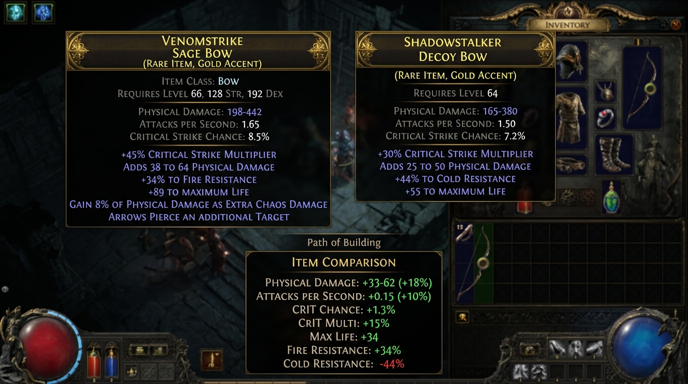

# PoE2 Gear Coach — Overlay

A transparent, always-on-top overlay for Path of Exile 2 that watches your clipboard and pops up a gear evaluation whenever you press **Ctrl+C** on an item in-game.

## How it works

PoE2 already copies item text to your clipboard when you press Ctrl+C on a hovered tooltip. This app watches the clipboard 400ms at a time. When it sees text that looks like a PoE2 item (`Item Class: …`), it scores it against your current build profile and shows a popup near your cursor — without you doing anything extra.

```
You hover item in PoE2
  → Press Ctrl+C (game copies item text)
    → Overlay detects new clipboard text
      → Scores it vs. your build
        → Popup appears near cursor
          → Press Esc or click ✕ to dismiss
```

Lower-risk approach: no game memory reading, no OCR, no input automation, and no game-file modification. It only reacts to clipboard item text that you copy yourself. Use at your own discretion.

## Side-by-Side Equipped Comparison

When comparing a copied item, the overlay automatically expands into a side-by-side view (when you have your current gear saved). It displays:
1. The **Equipped Item** on the left.
2. The **Copied Item** in the middle.
3. The **Evaluation & Stat Deltas** on the right, showing exactly what you gain or lose between the two items (`+` / `-` stat deltas) independent of the build's fit score.



---

## Quick start

> [!WARNING]
> **Windows SmartScreen warning?**  
> Click "More info" → "Run anyway". This happens because the installer is not yet code-signed.  
> The app only reads your clipboard — it does not write files outside its own userData folder.

### Prerequisites

- **Node.js 18+** — https://nodejs.org

### Install & run

```bash
# 1. Install dependencies (first time only)
npm install

# 2. Launch the overlay
npm start
```

The app starts in the system tray. A tray icon appears (bottom-right on Windows).

### Create a GitHub repo from this zip

After extracting the zip:

```bash
cd poe2-Item-Coach
git init
git add .
git commit -m "Initial PoE2 Gear Coach overlay"
git branch -M main
git remote add origin <your-github-repo-url>
git push -u origin main
```

Do not commit real API keys. Use the Settings screen to save keys locally on each computer.

### First-time setup

1. **Double-click the tray icon** (or right-click → "Settings / Build Import").
2. Import your `.build` files or paste Mobalytics guide text.
3. Set your **Player level**, **Str/Dex/Int**.
4. Select the right **Build stage** for where you are in the game.
5. Paste your current gear set in the Build Health Report section if you want copied items compared against what you are wearing.
6. Click **💾 Save to Overlay**.
7. Close the settings window.

Now go play. Press **Ctrl+C** on any item in PoE2 — the overlay pops up.

---

## Hotkeys

| Key | Action |
|-----|--------|
| `Ctrl+C` in-game | Auto-triggers overlay on any PoE2 item |
| `Ctrl+Shift+G` | Manual trigger — re-evaluate current clipboard |
| `Esc` | Dismiss the overlay |

---

## Building a distributable .exe / .dmg

```bash
# Windows
npm run build-win

# macOS
npm run build-mac

# Linux
npm run build-linux
```

Output goes to `dist/`. You can share the installer with friends.

---

## Project layout

```
poe2-Item-Coach/
├── package.json              ← Electron + electron-builder config
├── .gitignore                ← Keeps node_modules, dist, and secrets out of git
├── .env.example              ← Example only; do not commit real keys
├── SECURITY.md               ← Security notes and sharing guidance
├── CHANGELOG.md              ← Version notes
└── src/
    ├── main.js               ← Main process: clipboard watcher, windows, tray
    ├── preload.js            ← Secure IPC bridge (contextBridge)
    ├── overlay.html          ← Transparent popup shown in-game
    ├── overlay-renderer.js   ← Scoring engine for the popup
    ├── settings.html         ← Full settings / build import UI
    ├── app.js                ← Original browser app logic (unchanged)
    ├── styles.css            ← Original browser app styles (unchanged)
    ├── assets/
    │   ├── tray-icon.png     ← Tray icon
│   └── icon.ico          ← Windows installer icon
    └── sample-builds/        ← Ice Shot Deadeye sample .build files
```

---

## Tuning the clipboard poll rate

In `src/main.js`, change `CLIPBOARD_POLL_MS`:

```js
const CLIPBOARD_POLL_MS = 400; // ms — lower = more responsive, higher = less CPU
```

200ms is about as low as you'd want; 600ms is fine if you want to be gentle on CPU.

---

## Notes on GGG ToS

This tool **only reads the clipboard** after you copy an item yourself. It does not read game memory, inject into the process, automate clicks/keypresses, or modify game files. That is intentionally a lower-risk design, but no third-party tool can honestly promise zero policy risk. Use at your own discretion.

### Client Language Support

Please note that this tool currently **only supports the English Path of Exile 2 client**. The item parser and detection logic key off English headers (such as `Item Class:`, `Armour:`, `Requires:`, etc.). Non-English clients will not trigger the overlay.

---

## What's next

- [x] Add a tray icon image (`src/assets/tray-icon.png`)
- [ ] Auto-detect which character slot you have open based on the item text
- [x] Compare copied items against saved equipped gear by slot
- [x] Add **Set as equipped** from the overlay for fast gear replacement
- [ ] Direct `.build` zip import without manual extraction
- [ ] PoB/PoB2 pastebin import
- [x] Optional AI Coach using Gemini or OpenAI APIs
- [x] Repo-ready GitHub files and basic syntax check

---

## Optional AI Coach

The core gear scoring still works completely offline. AI Coach is optional and is meant to turn the rule-engine output into clearer next-step advice.

Supported providers:

- Gemini
- OpenAI

Setup:

1. Open **Settings / Build Import**.
2. Scroll to **Optional AI Coach**.
3. Enable AI Coach.
4. Choose provider and model.
5. Paste your API key.
6. Click **Save AI settings** or **Test AI**.

Security notes:

- API keys are stored locally in Electron `userData` as `ai-settings.json`.
- API keys are not written to exported health reports.
- API keys are not included in `.build` files or saved gear text.
- Leave the API key field blank to keep an existing saved key.
- Use **Clear saved API key** to remove it.

## Development Notes

When working with this repository, keep these files out of git:

```bash
node_modules/
dist/
.env
ai-settings.json
session.json
```

To run a basic syntax check:

```bash
npm run check
```

## AI Model Defaults

AI Coach uses provider-specific model presets so you do not have to type model IDs manually.

Default presets:
- Gemini: `gemini-2.5-flash`
- OpenAI: `gpt-5.4-nano`

The settings screen also keeps a Custom model option for accounts/endpoints that support a different exact model ID. API keys remain stored locally in Electron `userData` and are not written into project files or exported reports. If a chosen model ID is not available on your API account, the Test AI button will show the provider error so you can switch to Custom or another preset.

## PoB / pobb.in Import

The settings window has an **Import PoB / pobb.in current build** section. Paste a `pobb.in` URL and click **Import pobb.in**. The app fetches the public page through the Electron main process, then fills/uses visible data locally:

- Player level, when visible
- Life / ES / eHP
- Visible resistance summary
- DPS / hit chance
- Visible gear names
- Visible gem names
- The encoded PoB export code, stored locally for future decoding work

The app will also attempt to decode the full PoB export XML from the pobb.in raw endpoint to load exact equipped item stats, affixes, and attributes. If the preview stats are unavailable, it will fall back to using the raw export data.

## Updating without reinstalling every time

After the first `npm install`, routine updates should not require reinstalling dependencies. Keep your `node_modules` folder and update/pull only the changed source files.

```powershell
npm run check
npm start
```

Do not run `npm audit fix --force` for normal updates. It can upgrade Electron/electron-builder across major versions. See [UPDATE.md](file:///C:/Users/James/Desktop/poe2-Item-Coach/UPDATE.md) for the safer workflow.

### Build file import tip

If Windows only lets you pick one `.build` file, use **Choose build folder** instead. Extract the Mobalytics/build zip, choose the folder that contains the `.build` files, and the app will import all `.build` files in that folder.
